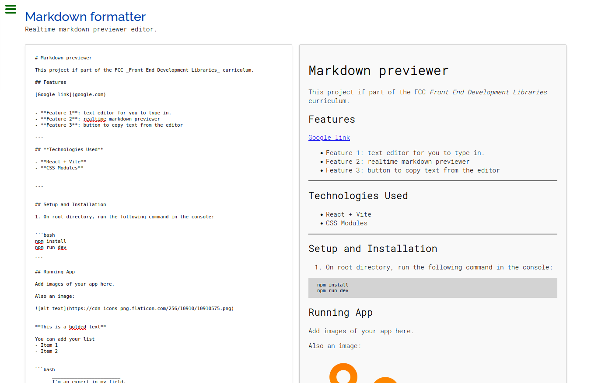
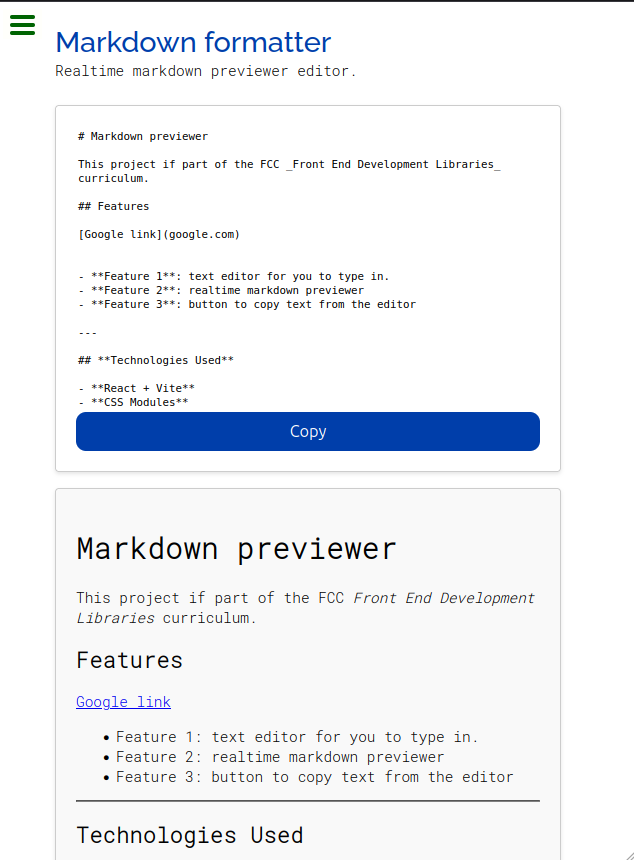

# Markdown previewer

This project if part of the FCC _Front End Development Libraries_ curriculum. Fully _responsive_ interface.

You may start typing your _markdownt formatting text_ on the left section and preview it on the right section in real-time.

## Features

- **Feature 1**: text editor for you to type in.
- **Feature 2**: realtime markdown previewer.
- **Feature 3**: button to copy text from the editor.

## **Technologies Used**

- **React + Vite**
- **CSS Modules**

## Setup and Installation

1. On root directory, run the following command in the console:

```bash
npm install
npm run dev
```

## Running App




## **Contact**

If you have any questions, suggestions, or feedback, feel free to reach out via:

📧 Email: armandopinedag@outlook.com

Happy coding! 🎉
